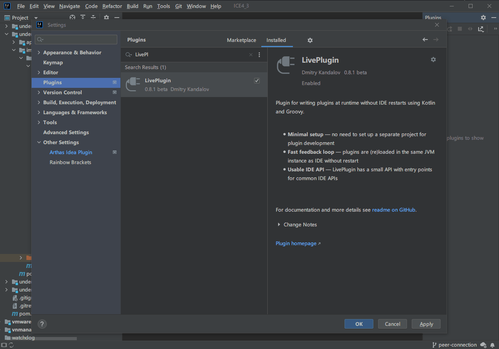

# IDEA 插件：quickAction

IDEA 自动化工作流插件，基于 LivePlugin 插件的动态 Kotlin 脚本和自行实现的 quickAction 插件。

## (真)一键替包
plugin.kts 实现了一键从打开的 Java 文件中找到其对应的 Maven 目录，编译 Jar 包，并且将编译后的产物上传到 ICE 单个或集群服务器中。

需要安装 LivePlugin 插件并且新建动态插件将 plugin.kts 加载运行，远程 ICE 配置和一些设置可在脚本中自行修改。

```kotlin
val compileFirst = true
val withRemoteBackup = true
val remotes = listOf(
    Remote("172.20.77.111", Path("/root/ice-test")),
    Remote("172.20.77.112", Path("/root/ice-test")),
    Remote("172.20.77.113", Path("/root/ice-test"))
)
```

## 一键编译并发送字节码
plugin.kts 也实现了自动将当前打开 Java 文件的 Maven 模块编译，并且找到生成的字节码文件，将其复制到测试环境，可用于 Arthas 字节码热更新。

下面是一个使用示例：



> 注意，需要安装 LivePlugin 插件，然后新建一个动态插件，将 plugin.kts 内容复制到此脚本并运行此脚本即可。 之后可从菜单 Tools 下找到注册的命令，修改脚本内容并重新加载以进行自定义配置。